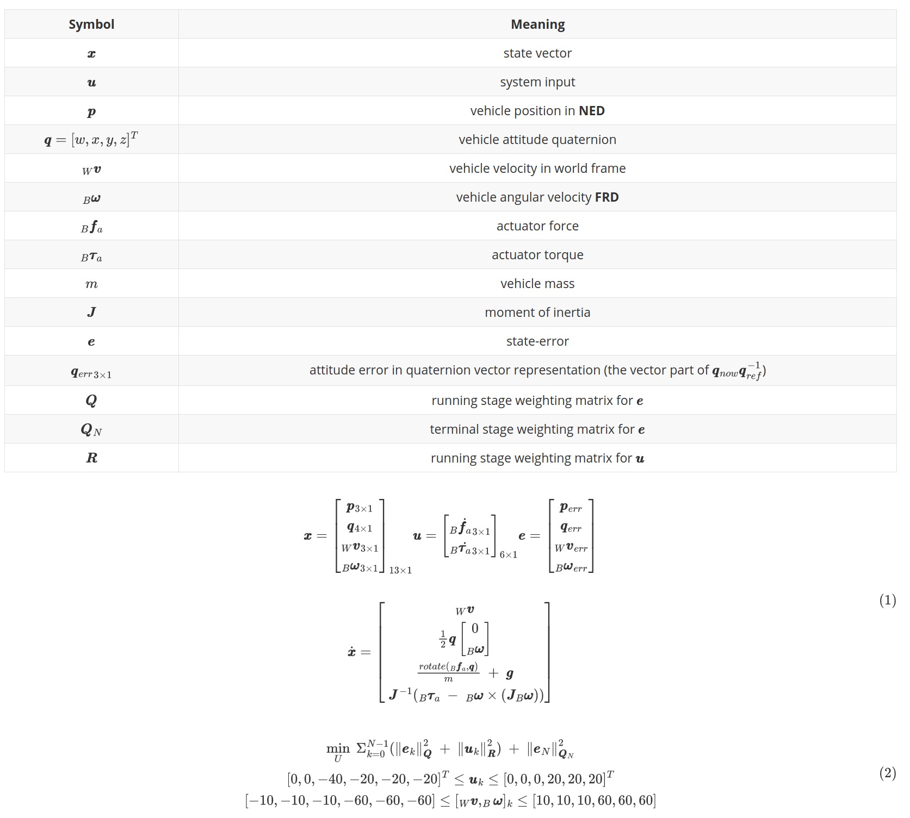

# problem formulation

## definitions

|             Symbol             |                           Meaning                            |
| :----------------------------: | :----------------------------------------------------------: |
|           $\pmb{x}$            |                         state vector                         |
|           $\pmb{u}$            |                         system input                         |
|          $$\pmb{p}$$           |                 vehicle position in **NED**                  |
|     $\pmb{q}=[w,x,y,z]^T$      |                 vehicle attitude quaternion                  |
|          $_W\pmb{v}$           |               vehicle velocity in world frame                |
|        $_B\pmb{\omega}$        |               vehicle angular velocity **FRD**               |
|        $_B{\pmb{f}_a}$         |                        actuator force                        |
|       $_B{\pmb{\tau}_a}$       |                       actuator torque                        |
|              $m$               |                         vehicle mass                         |
|           $\pmb{J}$            |                      moment of inertia                       |
|           $\pmb{e}$            |                         state-error                          |
| ${\pmb{q}_{err}}_{3 \times 1}$ | attitude error in quaternion vector representation (the vector part of $\pmb{q}_{now} \pmb{q}_{ref}^{-1}$) |
|           $\pmb{Q}$            |         running stage weighting matrix for $\pmb{e}$         |
|          $\pmb{Q}_N$           |        terminal stage weighting matrix for $\pmb{e}$         |
|           $\pmb{R}$            |         running stage weighting matrix for $\pmb{u}$         |

$$
\pmb{x}=\begin{bmatrix}
\pmb{p}_{3\times1}\\
\pmb{q}_{4\times1}\\
_W\pmb{v}_{3\times1}\\
_B\pmb{\omega}_{3\times1}\\
\end{bmatrix}_{13\times1}

\pmb{u}=\begin{bmatrix}
_B\dot{\pmb{f}_a}_{3\times1}\\
_B\dot{\pmb{\tau}_a}_{3\times1}
\end{bmatrix}_{6\times1}

\pmb{e}=\begin{bmatrix}
\pmb{p}_{err}\\
\pmb{q}_{err}\\
_W\pmb{v}_{err}\\
_B\pmb{\omega}_{err}\\
\end{bmatrix}
\\
\\
\dot{\pmb{x}}=\begin{bmatrix}
_W\pmb{v}\\
\frac{1}{2} \pmb{q} \begin{bmatrix}0 \\ _B\pmb{\omega} \end{bmatrix}\\
\frac{rotate(_B{\pmb{f}_a},\pmb{q})}{m}\ +\ \pmb{g}\\\
\pmb{J}^{-1}(_B{\pmb{\tau}_a}\ -\ _B\pmb{\omega} \times (\pmb{J}_B\pmb{\omega}))\\
\end{bmatrix}
$$

$$
\min_U\ \Sigma_{k=0}^{N-1}(\norm{\pmb{e}_k}^2_{\pmb{Q}}\ +\ \norm{\pmb{u}_k}^2_{\pmb{R}})\ +\ \norm{\pmb{e}_N}^2_{\pmb{Q}_N}
\\ [0, 0, -40, -20, -20, -20]^T \le \pmb{u}_k \le [0, 0, 0, 20, 20, 20]^T\\
[-10, -10, -10, -60, -60, -60] \le [_W\pmb{v},_B\pmb{\omega}]_k \le [10, 10, 10, 60, 60, 60]
$$

